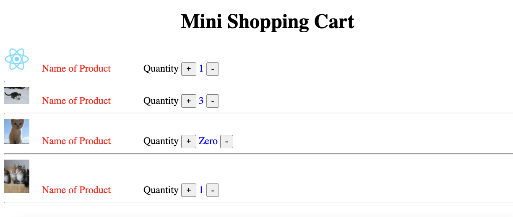

## React components and PropsHome work


Given a list of products (as an array of objects, as seen in productsData.js) [here](Labs/ProductsJSONData/products.js).
Render a `<Product />` component (which you'll also need to create) for each product in the list.

Also add the images for each of the products using some url online!

Make sure to use the array's `.map()` method to create these components, and 
don't forget to pass a `key` prop to it to avoid the warning.


```js
import productsData from "./Products"

function App() {
  return (
    <div>
        
    </div>
  )
}

export default App
```
### Mini shoping cart for the products

Handle states of the class based components. 
For the products exercise, which we have already worked above.
Do as shown in the image File here



For all the products available in the jsonData from yesterday homework, available [here](products.js). Add images to all the products to be displayed as shown in the example diagram.

You must use good styling in your home work. Keep in mind that the shoping cart is displayed in a nicely styled table. 

#### Bonus
Put a button for each product, read the quantity selected and show this in the next column.